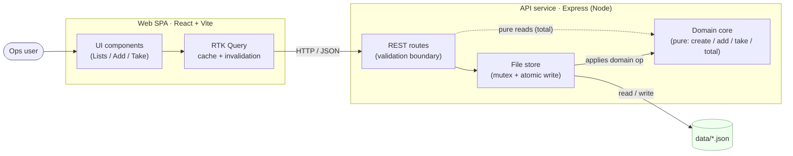
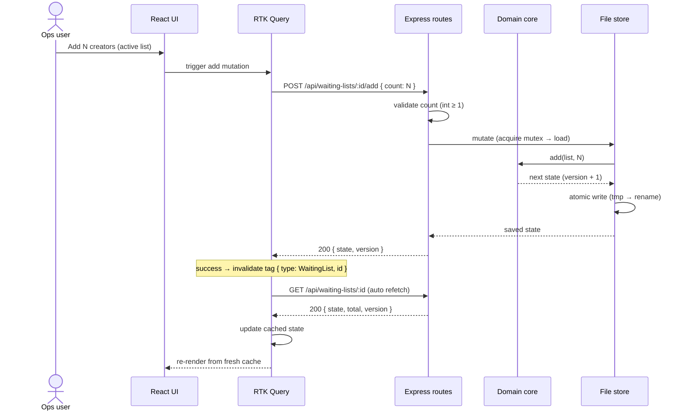
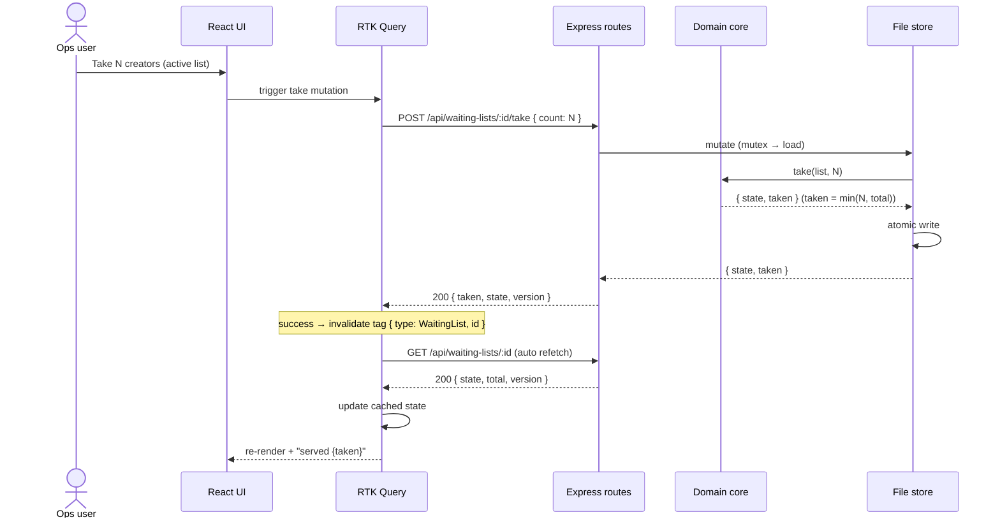
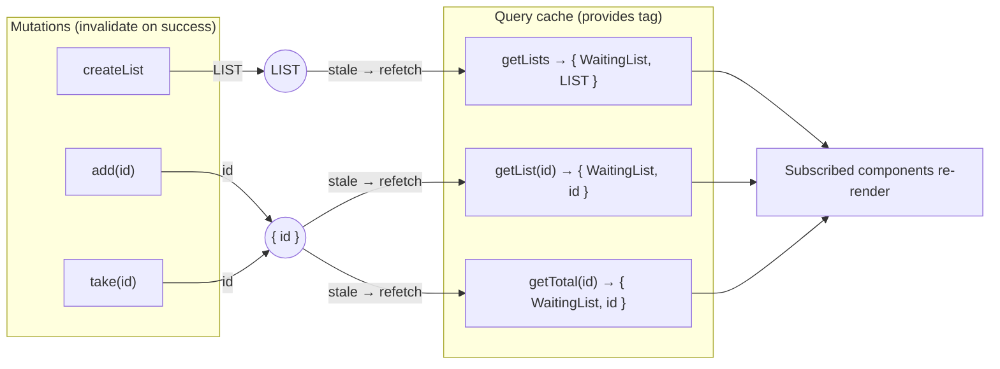
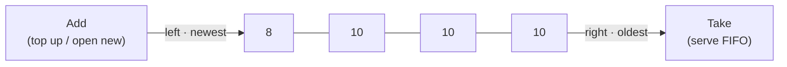
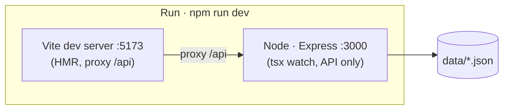

# Architecture — Elective Waiting List

> Global view of the system: the services, how they communicate, and how a request
> flows end to end. Detailed domain rules are in
> [`domain-design.md`](./domain-design.md); library choices are in
> [`tech-stack.md`](./tech-stack.md).

## 1. Overview

A web tool to manage **waiting lists** of fixed-size **cohorts**. Multiple lists
can be created, each with its own fixed capacity. A **React SPA** talks over
**REST/JSON** to an **Express API** that runs a **pure domain core** and persists
state to **JSON files on disk** (no database). The client stays current through
cache invalidation and refetching, not server push.

Design principles:

- **Pure core, thin shell.** All waiting-list logic is pure and IO-free; HTTP and
  the filesystem are thin adapters around it. The rules are therefore testable in
  isolation and portable.
- **Minimal infrastructure.** No database, message broker, or WebSockets — a
  folder of JSON files and a single Node process.
- **Scoped down, not boxed in.** Only what the brief needs is built. Where a larger
  system would grow — multi-process storage, an event log, push updates — the seams
  stay clean (per-list files, a `version` stamp, tag-based cache invalidation), so
  those become additive changes later rather than rewrites.

## 2. Services / components



| Component         | Responsibility                                                                                                                                                                                           | Depends on                       |
| ----------------- | -------------------------------------------------------------------------------------------------------------------------------------------------------------------------------------------------------- | -------------------------------- |
| **UI components** | List/select/create lists; render the active list's cohorts, total, and controls; dispatch mutations.                                                                                                     | RTK Query hooks only.            |
| **RTK Query**     | Server-state cache. Query endpoints **provide** tags; mutations **invalidate** them on success, which auto-refetches affected queries and updates the cache. Invalidation-only — no optimistic patching. | REST endpoints, response shapes. |
| **REST routes**   | HTTP boundary: parse and validate input, map results and errors to status codes.                                                                                                                         | Domain core, file store.         |
| **Domain core**   | The rules: create/add/take/total. Pure, no IO.                                                                                                                                                           | Plain data only.                 |
| **File store**    | Enumerate, load, and save lists; serialize mutations (mutex); atomic writes; `version` bump.                                                                                                             | Filesystem, domain core.         |
| **`data/*.json`** | Durable state, one file per list (`<id>.json`).                                                                                                                                                          | —                                |

All mutations go through `store.withList(id, fn)`: the store loads the list, applies
the pure domain function, and atomically saves. Reads load via the store; `total` is
a pure domain helper computed on the loaded state.

## 3. Request flow — Add



## 4. Request flow — Take



## 5. Client caching with RTK Query

Client state is kept current through **tag-based cache invalidation**, not server
push. Two tag granularities are used: a **collection tag** for the list of lists,
and a **per-list tag** for an individual list's state.

- **Query endpoints provide tags.**
  - `getLists` (collection) provides `{ type: 'WaitingList', id: 'LIST' }`.
  - `getList(id)` and `getTotal(id)` provide `{ type: 'WaitingList', id }`.
- **Mutations invalidate tags on success** (a `4xx`/`5xx` leaves the cache
  untouched):
  - `createList` → `LIST` (the collection refetches).
  - `add(id)` / `take(id)` → `{ id }` (and `LIST` if the collection shows totals).
- **Invalidation triggers an automatic refetch.** RTK Query marks the affected
  queries stale, refetches them, and writes fresh server state into the cache.
  Components subscribed via hooks re-render automatically — no manual `refetch()`.
- **Optimistic updates: not used.** The implementation relies on invalidation + refetch
  only (per CLAUDE.md). An `onQueryStarted` optimistic patch is a possible enhancement, but
  it adds rollback complexity for little gain against a fast local API.



## 6. The domain in one picture

Within a single list, cohorts form an ordered deque. **Add** acts on the newest
(left) end; **Take** serves FIFO from the oldest (right) end. Because nothing
touches the middle, only the two ends can ever be partial.



Full rules, field model, and edge cases: [`domain-design.md`](./domain-design.md).

## 7. Persistence & concurrency (high level)

- **Storage:** one JSON file per list under `data/`, named `<id>.json`.
  Enumerating lists scans `data/*.json`. Git-ignored.
- **Atomic writes:** write to `*.tmp`, then `rename` over the target (atomic on
  POSIX), avoiding partially written files.
- **Serialization:** every mutation passes through an async **mutex** (keyed per
  list id) so read-modify-write cycles cannot interleave within the single Node
  process.
- **Versioning:** each successful write bumps `version` — a monotonic stamp the
  client uses to reconcile optimistic updates and discard stale responses. The
  per-id mutex (above) serializes writes, so no client-supplied expected-version
  check is required; accepting one (e.g. `If-Match`) is the seam for multi-process
  concurrency later.
- **Persist on change only:** the store skips the atomic write when a mutation leaves
  state unchanged (`version` not bumped) — e.g. `take` on an empty list. No-effect
  operations cost a read but never a write.

## 8. Runtime & deployment



- **How it runs:** `npm run dev` starts two processes — Vite (web) and Express (API) —
  with Vite proxying `/api` to Express; open the Vite URL. Express is **API-only**; the
  SPA is served by Vite.
- **Production serving is out of scope (dev-only).** `vite build` produces the static SPA,
  but serving it isn't wired up — a real deploy would host the build on any static host and
  run Express separately, or add single-port serving to Express later (see §10).
- The app tier is stateless apart from the `data/` folder; persist that folder to retain
  state across restarts.

## 9. Repository structure

A monorepo (npm workspaces) with three packages — `server`, `web`, and a `shared`
contract. Dependencies point inward only: HTTP → controller → domain/store, and
pure logic has no knowledge of HTTP or the filesystem.

**Conventions**

- **One module, one folder, its own types.** Each implementation keeps its code and
  a co-located `*.types.ts` beside it; types are never pooled into a catch-all file
  or mixed across implementations.
- **`shared/` is the single source of truth for the wire contract** (domain
  entities + request/response DTOs). `server` and `web` import it rather than
  redeclaring shapes; each side's local `*.types.ts` holds only its own concerns
  (handler internals, component props), not the contract.

### Server — `/server/src`

```
config/                  env + constants (port, data dir, default capacity)
  config.ts
domain/                  pure business rules — no IO
  waitingList.ts         create / add / take / total
  waitingList.types.ts
  waitingList.test.ts
store/                   persistence: enumerate, load, save
  fileStore.ts           atomic write (tmp → rename), per-id mutex, withList() helper
  fileStore.types.ts
controllers/             HTTP handlers: validate input, run domain op via store, map errors
  waitingLists.controller.ts
schemas/                 Zod request schemas + inferred types
  waitingLists.schema.ts
routes/                  Express Router per resource + mount under /api, health, 404
  waitingLists.routes.ts
  index.ts
middleware/              cross-cutting: central error handler, 404 handler
  errorHandler.ts
  notFound.ts
app.ts                   build the Express app (middleware + routes) — no listen
index.ts                 bootstrap: create app, listen on PORT
```

**Layering** — `routes/` wires paths to controllers (one router file per resource;
`index.ts` mounts them under `/api` with health/404). Controllers stay thin: they
read validated input and call the domain through the store's `withList(id, fn)`
helper, which owns the load → mutate → atomic-save cycle under a per-id mutex.
There is no separate service layer — that store helper carries the orchestration
that would otherwise justify one.

### Web — `/web/src`

```
app/                     app-wide Redux wiring
  store.ts               configureStore: registers the api reducer + middleware
api/                     RTK Query data layer
  baseApi.ts             createApi base: baseQuery, tagTypes, empty endpoints
  waitingLists/
    waitingLists.api.ts  queries + mutations + tag wiring (injectEndpoints)
    waitingLists.types.ts  request/response + hook types for this API
components/              reusable, presentational components (no data fetching)
  CohortBar/
    CohortBar.tsx
    CohortBar.types.ts
  NumberField/
    NumberField.tsx
    NumberField.types.ts
views/                   page-level screens composing api hooks + components
  WaitingListsView/
    WaitingListsView.tsx
    WaitingListsView.types.ts
App.tsx                  top-level layout
main.tsx                 React entry: <Provider> + render
```

**Layering** — `api/` owns all server communication: the base config lives once in
`baseApi.ts`, and each resource gets a folder that injects its own endpoints.
`components/` are presentational and reusable; `views/` compose hooks and
components into screens. (`views/` replaces a generic `features/`; `pages/` or
`screens/` are equally acceptable names.)

### Workspace root

```
/shared                  shared TS contract (domain entities + API DTOs)
/data                    JSON persistence (git-ignored)
/docs                    architecture · tech-stack · domain-design · implementation + brief
```

## 10. Scope & future work

**The brief:** create a list (configurable capacity), add, take (FIFO), total, and a
web UI. Everything below is a deliberate scoping choice.

**Added beyond the brief:**

- **Multiple lists** — create and operate on several, not one; makes it a tool, not a demo.
- **`version` per list** — monotonic stamp for client reconciliation; an
  optimistic-concurrency seam if multi-process writes are ever added.
- **`seq` / `nextSeq`** — stable cohort labels (see `domain-design.md`).

**Left out (intentionally):**

- **Rename / delete a list** — not in the brief; keeps the surface minimal.

**Future work:**

- **Durable storage** — a database (e.g. SQLite: single-file, transactional)
  instead of rewriting a JSON file per mutation; the real fix if volume or
  concurrency grows (not a different data structure).
- **Audit log** — append-only record of add/take/create.
- **Push updates** — WebSockets/SSE instead of refetch-on-invalidate.
- **Single-port serving** — Express serving the built SPA alongside the API (today the SPA
  runs under Vite; running is dev-only).
- **Editable capacity** — would snapshot `capacity` onto each cohort at open time, so
  a change applies only to new cohorts and can't break existing ones. Deferred: the
  brief calls capacity _fixed_.

## 11. Cross-references

- **Libraries & tooling:** [`tech-stack.md`](./tech-stack.md)
- **Domain model, algorithms, edge cases, API contract:** [`domain-design.md`](./domain-design.md)
- **AI usage writeup:** see the README "AI usage" section
- **Brief:** [`take-home-description.md`](./take-home-description.md)
