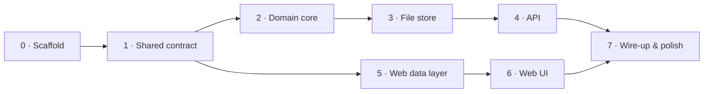

# Implementation tasks

Build order for the waiting-list tool. **TDD throughout** — write the failing test
first, then the code. Live status: [`progress.md`](./progress.md). Design:
[`../architecture.md`](../architecture.md) · [`../domain-design.md`](../domain-design.md)
· [`../tech-stack.md`](../tech-stack.md).

## 0 · Scaffold

- [ ] npm workspaces: `server`, `web`, `shared`; root scripts (`dev`, `test`, `lint`, `build`).
- [ ] Shared TS config; ESLint + Prettier; Vitest per package.

## 1 · Shared contract (`shared/`)

- [ ] Domain entities (`WaitingList`, `Cohort`) + API request/response DTOs.

## 2 · Domain core (`server/src/domain/`) — TDD

- [ ] Tests: brief example flow end-to-end + each §4 edge case.
- [ ] Implement `create` / `add` / `take` / `total` to green; hold the invariant.

## 3 · File store (`server/src/store/`) — TDD

- [ ] Tests: save/load round-trip, atomic write, per-id mutex serializes writes.
- [ ] Implement `fileStore` + `withList(id, fn)`; bump `version` on write.

## 4 · API (`server/src/{schemas,controllers,routes,middleware}`) — TDD

- [ ] Zod schemas for `count` / `capacity` / `name`.
- [ ] Supertest: happy path per endpoint + `400` / `404`.
- [ ] Thin controllers; routes under `/api`; error handler; health + 404.

## 5 · Web data layer (`web/src/api/`)

- [ ] `baseApi` (baseQuery, tagTypes); `waitingLists.api` queries + mutations + tag wiring.

## 6 · Web UI (`web/src/{components,views,app}`)

- [ ] Presentational `components` (CohortBar, NumberField) — RTL tests.
- [ ] `WaitingListsView` composes hooks + components; Redux store + `<Provider>`.

## 7 · Wire-up & polish

- [ ] `npm run dev` runs Vite + Express (concurrently); Vite proxies `/api`.
- [ ] README (run instructions); manual smoke test of add / take / total.
