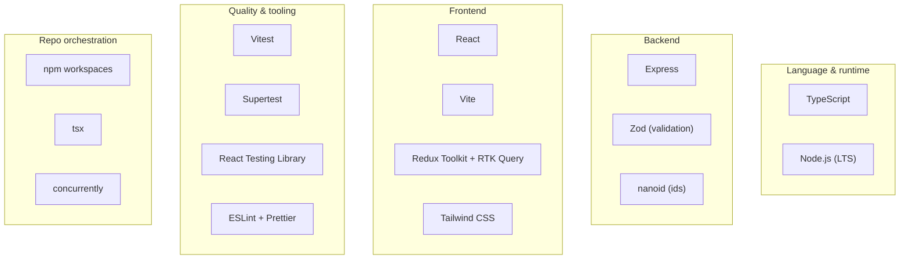

# Tech Stack — Elective Waiting List

> Technologies and libraries used, their purpose, the rationale, and the main
> alternative considered. The stack favors standard, minimal tooling; each
> dependency is justified below.

## At a glance

## Language & runtime

| Tech              | Purpose                                                         | Rationale                                                                 | Alternative considered                                      |
| ----------------- | --------------------------------------------------------------- | ------------------------------------------------------------------------- | ----------------------------------------------------------- |
| **TypeScript**    | One typed language across server, client, and shared contracts. | Catches shape mismatches at compile time; shared types prevent API drift. | Plain JS — forgoes the type safety the pure core relies on. |
| **Node.js (LTS)** | Runtime for the API and tooling.                                | Ubiquitous and aligned with the JS frontend.                              | Deno/Bun — viable, but offer no advantage here.             |

## Backend

| Library     | Purpose                                                                            | Rationale                                                                                 | Alternative considered                                                               |
| ----------- | ---------------------------------------------------------------------------------- | ----------------------------------------------------------------------------------------- | ------------------------------------------------------------------------------------ |
| **Express** | HTTP server and routing for the REST API.                                          | Minimal and widely understood.                                                            | Nest (heavier than needed); Fastify (viable, Express is the lower-surprise default). |
| **Zod**     | Runtime validation of request bodies (`count`, `capacity`) with inferred TS types. | A single schema yields both validation and types, producing clean `400`s at the boundary. | Hand-rolled checks (error-prone); Joi (no TS inference).                             |
| **nanoid**  | Stable ids for lists and cohorts.                                                  | Small, fast, URL-safe.                                                                    | `crypto.randomUUID` — also acceptable; nanoid is shorter.                            |

> No ORM or DB driver — persistence uses the Node `fs` API to write JSON (see
> [architecture §7](./architecture.md#7-persistence--concurrency-high-level)).

## Frontend

| Library                       | Purpose                                                                                            | Rationale                                                    | Alternative considered                                                            |
| ----------------------------- | -------------------------------------------------------------------------------------------------- | ------------------------------------------------------------ | --------------------------------------------------------------------------------- |
| **React**                     | UI rendering.                                                                                      | Standard and pairs with RTK Query.                           | Svelte/Vue — viable, but RTK Query integrates with React.                         |
| **Vite**                      | Dev server (HMR) and production build.                                                             | Fast startup, simple `/api` proxy, minimal config.           | CRA (deprecated); Next.js (SSR/routing not required).                             |
| **Redux Toolkit + RTK Query** | Server-state cache, mutations, and tag invalidation (invalidation refetch, no optimistic updates). | Provides cache invalidation and refetching with little code. | TanStack Query (capable, not Redux-based); plain Redux thunks (more boilerplate). |

## Styling

| Choice                                        | Purpose                                    | Rationale                                                                                                                                                                       |
| --------------------------------------------- | ------------------------------------------ | ------------------------------------------------------------------------------------------------------------------------------------------------------------------------------- |
| **Tailwind CSS v4** (via `@tailwindcss/vite`) | Lay out cohort boxes, total, and controls. | Utility classes with near-zero config — one Vite plugin and a single `@import "tailwindcss"`. Visual polish isn't graded, so the layout stays light. (Plain CSS would also do.) |

## Quality & tooling

| Library                   | Purpose                                                    | Rationale                                                                                                        |
| ------------------------- | ---------------------------------------------------------- | ---------------------------------------------------------------------------------------------------------------- |
| **Vitest**                | Unit tests for the domain core and store; component tests. | TS-native, fast, one runner for both ends. (Jest is the alternative; Vitest integrates more directly with Vite.) |
| **Supertest**             | HTTP-level API tests against Express.                      | Standard approach for Express endpoint tests.                                                                    |
| **React Testing Library** | Component behavior tests.                                  | Tests behavior rather than implementation.                                                                       |
| **ESLint + Prettier**     | Linting and formatting.                                    | Consistent style; keeps diffs reviewable.                                                                        |

## Repo orchestration

| Tool               | Purpose                                                            | Rationale                                                                            |
| ------------------ | ------------------------------------------------------------------ | ------------------------------------------------------------------------------------ |
| **npm workspaces** | Monorepo: `server`, `web`, `shared` in one repo with shared types. | No extra tooling; a single `npm install`. (pnpm/Turborepo unnecessary at this size.) |
| **tsx**            | Run and watch the TS server in dev without a build step.           | Fast, zero-config TS execution. (ts-node is the heavier alternative.)                |
| **concurrently**   | Run Vite and Express together with one command.                    | Simple developer experience for `npm run dev`.                                       |

## Deliberately excluded

- **Database** — JSON files satisfy the persistence requirement; a database is out
  of scope. SQLite (single-file, transactional, no separate server) is the natural
  next step if persistence or concurrency requirements grow.
- **tRPC** — REST + RTK Query covers the need; tRPC's end-to-end types add a layer
  this small API doesn't require.
- **WebSockets / Socket.IO** — a single-operator tool; invalidation and refetching
  cover the UX (see [architecture §3](./architecture.md#3-request-flow--add)).
- **Auth, Docker, CI** — out of scope for this exercise; addable later.

## Versions

Dependencies are pinned to **exact** versions (no semver ranges), each the latest stable at
build time: TypeScript 6, Node LTS, Express 5, Zod 4, nanoid 5; React 19, Vite 8, Redux
Toolkit 2, Tailwind 4; Vitest 4, Supertest 7, React Testing Library 16. The lockfile is the
source of truth.
